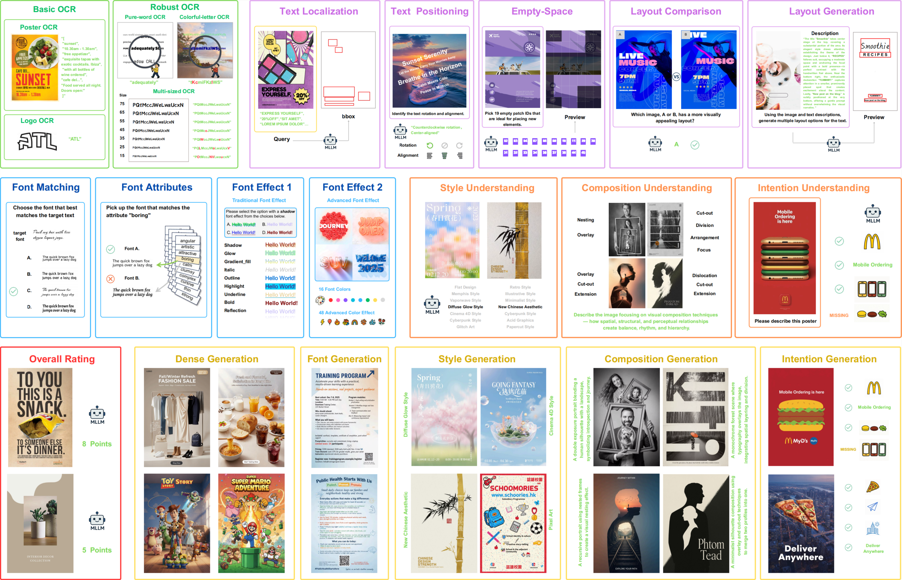

# PosterIQ-Benchmark
[CVPR2026] PosterIQ: A Design Perspective Benchmark for Poster Understanding and Generation  
[arXiv] https://arxiv.org/abs/2603.24078  
[HuggingFace] https://huggingface.co/datasets/ArtmeScienceLab/PosterIQ


  

## Citation

```bibtex
@inproceedings{cvpr2026posteriq,
    title={PosterIQ: A Design Perspective Benchmark for Poster Understanding and Generation},
    author={Feng, Yuheng and Zhang, Wen and Duan, Haodong and Zou, Xingxing},
    booktitle={Proceedings of the IEEE/CVF Conference on Computer Vision and Pattern Recognition (CVPR)},
    year={2026}
}
```


## Contact

If you have any questions, suggestions, or run into any issues, please feel free to open an issue in this repository. 

For other inquiries, you can contact me directly at:
- **Yuheng Feng**: [bruce.feng@connect.polyu.hk]
